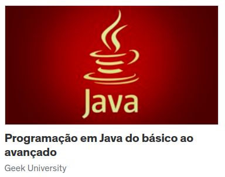

# Java COMPLETO 2023 Programação Orientada a Objetos +Projetos

## O que eu estudei no curso

- Lógica de programação e algoritmos

- Sintaxe da linguagem Java

- Classes, atributos e métodos

- Construtores, sobrecarga, encapsulamento

- Estruturas de dados: arrays e coleções

- Enumerações, composição

- Herança, polimorfismo, interfaces

- Tratamento de exceções

- Generics

- Programação funcional e expressões lambda, Stream API

- Manipulação de arquivos

```
Java COMPLETO 2023 Programação Orientada a Objetos +Projetos


```

<a href= "https://www.udemy.com/course/java-curso-completo">Nelio Alves</a>

 <br>

 <p align ="center"> </p>
<br><br><br>

# Programação em Java do básico ao avançado

## O que eu estudei no curso

- Estruturas de Controle e Decisão;
- Tipos de Dados;
- Vetores e Matrizes (Arrays Unidimensionais e Multidimensionais);
- Funções;
- Orientação a Objetos;
- Pacotes;
- Modificadores de Acesso;
- Herança e Polimorfismo;
- Classes Abstratas;
- Atributos e Métodos Estáticos;
- Criação de Executáveis (jar) e Documentação;
- Coleções;
- Threads (Programação Paralela);
- Estruturas de Dados (Fila, Pilha, Listas Ligadas e etc);
- Mais de 300 exercícios!
- Projeto 1 - Game;
- Projeto 2 - Mercado;
- Projeto 3 - Banco;
- E muito mais!

```
Programação em Java do básico ao avançado
```

<a href= "https://www.udemy.com/course/programacao-em-java-essencial/">Geek University</a>

 <br>

 <p align ="center"> </p>
<br><br><br>

# Java 2022 COMPLETO: Do Zero ao Profissional + Projetos!

## O que eu estudei no curso

> O curso de Java 2020 foi completamente refeito para se tornar o conteúdo de Java<br> mais atualizado e completo da língua portuguesa! Neste curso você aprenderá Java<br> do absoluto zero até se tornar um programador profissional, dominando os recursos <br>mais moderno da linguagem. Alguns dos assuntos abordados:

- Algoritmo e Estrutura de Dados

- Fundamentos da Linguagem Java

- Estruturas de Controle

- Classes, Objetos, Métodos

- Orientação a Objeto

- Encapsulamento, Herança, Polimorfismo e Abstração

- Lambdas

- Stream API

- Tratamento de Exceções

- JavaFX

- Banco de Dados Relacional

- Bando de Dados NÃO Relacional (NoSQL)

- JPA (Hibernate)

<a href= "https://www.udemy.com/course/java-curso-completo"></a>

 <br>

 <p align ="center"> </p>
<br><br><br>
